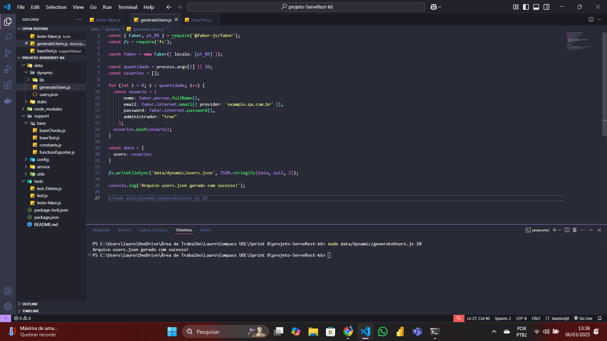
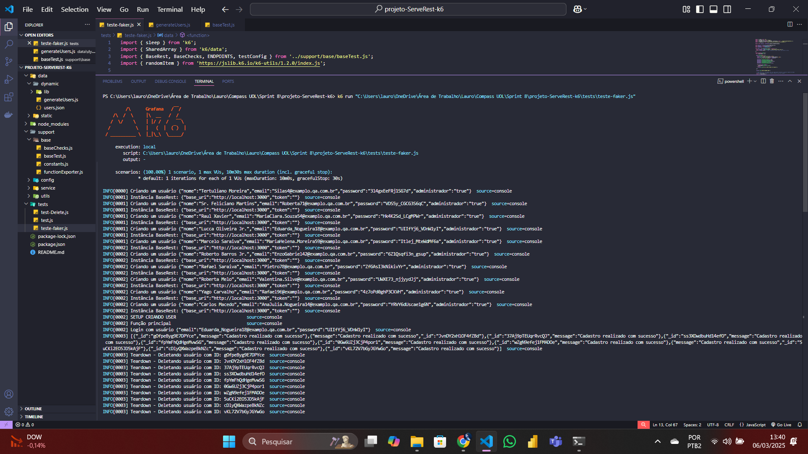
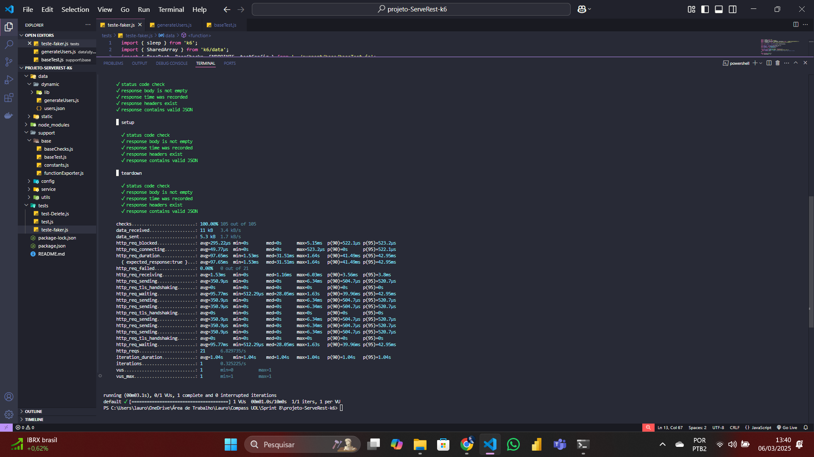

# Testes de Performance - API ServeRest

## Objetivo

Este Pasta armazena os códigos para os testes da API ServeRest atualizados com base nas alterações feitas a partir dos vídeos da Sprint 8.

## Resultados Obtidos

Maior senso organizacional de código e reutilização do mesmo.

### Gerando arquivo JSON de usuários com faker

### Testando a API ServeRest com os usuários gerados pelo faker

## Conclusão

As melhorias aplicadas nos vídeos de testes na API ServeRest permitiram um aprimoramento na organização de códigos, e na sua reutilização. Tendo se aprofundado muito mais na utilização do faker de modo dinâmico que na sprint anterior.

## Dispositivo de testes

- **Modelo:** Acer Nitro 5
- **Processador:** 11th Gen Intel(R) Core(TM) i7-11800H @ 2.30GHz   2.30 GHz
- **RAM Instalada:** 16,0 GB (utilizável: 15,8 GB)
- **Tipo de Sistema:** Sistema operacional de 64 bits, processador baseado em x64
