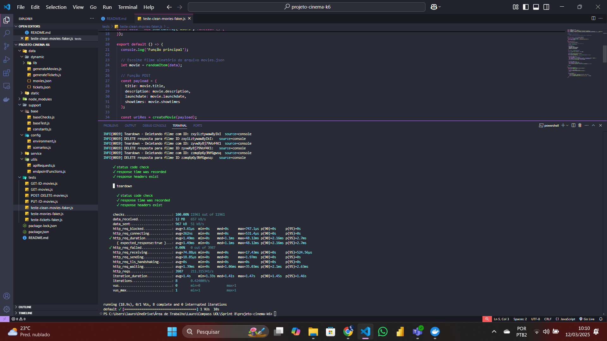

# Testes de Performance - API nestjs-cinema

## Objetivo

Esta pasta contém os códigos e configurações para os testes de performance da API **nestjs-cinema**.

## Geração de Dados de TesteRodando a API localmente

### Analizando Imagem da API

## Geração de Dados de Teste

Os arquivos JSON utilizados nos testes são gerados dinamicamente com a biblioteca **faker**:

- **Filmes:** `generateMovies`
  
- **Ingressos:** `generateTickets`
  

## Testando a API com os Dados Gerados

Os testes são realizados utilizando os arquivos gerados pelo **faker**:

- **Testando a API com filmes:**  
  
- **Testando a API com ingressos:**  
  

## Métricas de Performance

Durante os testes, as seguintes métricas são monitoradas:

- **Tempo médio de resposta:** Inferior a **900ms** para rotas principais, com um limite máximo de **1s**.
- **Throughput:** Pelo menos **20 requisições simultâneas** em uma janela de **2-5 minutos**.
- **Taxa de erros:** Até **5% de falhas** antes de considerar um teste como falho.
- **Tempo de recuperação:** Após testes de estresse, o sistema deve se recuperar em até **1 minuto**, mantendo a integridade dos dados.

## Cenários de Teste de Performance

Os testes foram estruturados para avaliar o comportamento da API em diferentes condições:

### 1. Teste de Fumaça (Smoke Test)
**Objetivo:** Validar rapidamente a estabilidade da API com carga mínima.
- **Usuários virtuais (VUs):** 1
- **Duração:** 10s
- **Critérios de sucesso:**
  - 95% das requisições abaixo de **1500ms**
  - Taxa de erro menor que **5%**

### 2. Teste de Carga (Load Testing)
**Objetivo:** Avaliar o desempenho da API sob condições normais de uso.
- **Requisições simultâneas:** 30-50
- **Duração total:** 5 minutos
- **Critérios de sucesso:**
  - 95% das requisições abaixo de **4000ms**
  - Taxa de erro menor que **5%**

### 3. Teste de Pico (Spike Testing)
**Objetivo:** Analisar a resposta da API a um aumento súbito de tráfego.
- **Requisições simultâneas:** Até 100
- **Duração total:** 50s
- **Critérios de sucesso:**
  - 95% das requisições abaixo de **1200ms**
  - Taxa de erro menor que **15%**

### 4. Teste de Estresse (Stress Testing)
**Objetivo:** Identificar o limite da API sob alta demanda.
- **Requisições simultâneas:** Até 100
- **Duração total:** 6 minutos
- **Critérios de sucesso:**
  - 95% das requisições abaixo de **1000ms**
  - Taxa de erro menor que **10%**
  - Recuperação total do sistema em até **1 minuto**

### 5. Teste de Resistência (Endurance Testing)
**Objetivo:** Avaliar a estabilidade da API com carga sustentada ao longo do tempo.
- **Requisições simultâneas:** 50
- **Duração total:** 20 minutos
- **Critérios de sucesso:**
  - 95% das requisições abaixo de **1000ms**
  - Taxa de erro menor que **5%**

### 6. Teste de Performance de Filmes (moviesPerformanceTest)
**Objetivo:** Avaliar o impacto de operações em massa sobre a entidade "Filmes".
- **Carga máxima:** 100 requisições/s
- **Critérios de sucesso:**
  - Criação: **95% abaixo de 200ms**
  - Listagem: **95% abaixo de 100ms**
  - Detalhes: **95% abaixo de 50ms**
  - Atualização: **95% abaixo de 300ms**
  - Exclusão: **95% abaixo de 400ms**
  - Taxa de erro menor que **5%**

### 7. Teste de Performance de Ingressos (ticketsPerformanceTest)
**Objetivo:** Avaliar o impacto de operações em massa sobre a entidade "Ingressos".
- **Carga máxima:** 50 requisições/s
- **Critérios de sucesso:**
  - 95% das requisições abaixo de **300ms**
  - Taxa de erro menor que **5%**

## Ferramentas Utilizadas

- **Docker:** Para rodar a API localmente.
- **K6:** Para execução dos testes de carga e análise de métricas.
- **Node.js:** Para rodar a API localmente.
- **GitHub:** Para automação e versionamento dos testes.

## Dispositivo de Testes

Os testes foram executados no seguinte ambiente:

- **Modelo:** Acer Nitro 5
- **Processador:** Intel Core i7-11800H (11ª geração) @ 2.30GHz
- **Memória RAM:** 16GB
- **Arquitetura:** 64 bits (x64)

## Conclusão

Os testes permitem avaliar o comportamento da API nestjs-cinema em diferentes condições de carga, garantindo a estabilidade e desempenho esperado.

## Melhorias Propostas

Com base nos testes realizados, algumas otimizações podem ser aplicadas para melhorar o desempenho da API, como ajustes no banco de dados, caching de respostas e balanceamento de carga.

